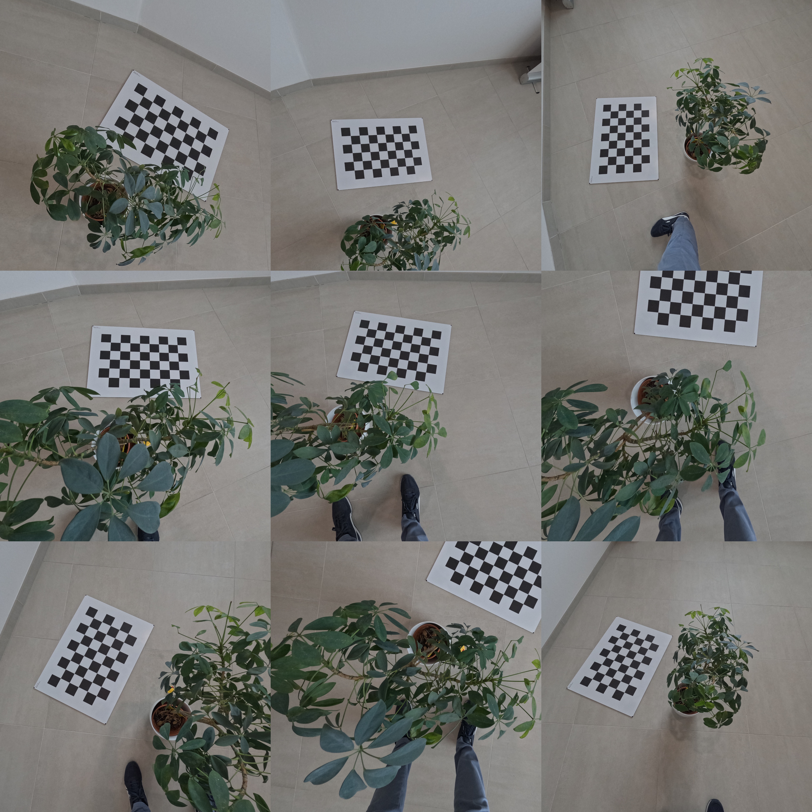

---
title: "Exploiting Out-of-Focus Properties in Image Stitching"
subtitle: "https://github.com/cheind/image-stitch"
author: "Christoph Heindl"
date: "2024-10"
comment: "pandoc -f markdown+tex_math_dollars+yaml_metadata_block+implicit_figures --citeproc OutOfFocusAnalysis.md -o OutOfFocusAnalysis.pdf"
bibliography: biblio.bib
---

# Introduction

In [PlanarImageStitching](PlanarImageStitching.md), we highlighted the issue of ghosting artifacts that arise during image stitching when the target plane assumption is not met. Objects that do not lie on the assumed target plane can appear misaligned or scattered into inconsistent positions across different viewpoints, leading to visual distortions. 

This effect can be exploited to enhance visibility of in-focus objects that are heavily occluded by out-of-focus ones. This technique has valuable applications in areas such as search-and-rescue operations and ground fire detection, where infrared temperature signatures of people or fires may be partially obscured by trees or foliage, allowing for more effective detection despite these visual obstructions [@kurmi2018airborne].

# Scenario

Here, we present a simplified search-and-rescue scenario. The images below are a subset of 17 captured by a 'drone' flying over a forested area (simulated using plants) that conceals a hidden object (a rubber duck). A calibration pattern is included in the scene to facilitate referencing specific viewpoints.

# Method

## Principle

## Weights from outliers

## Weights from color

# References