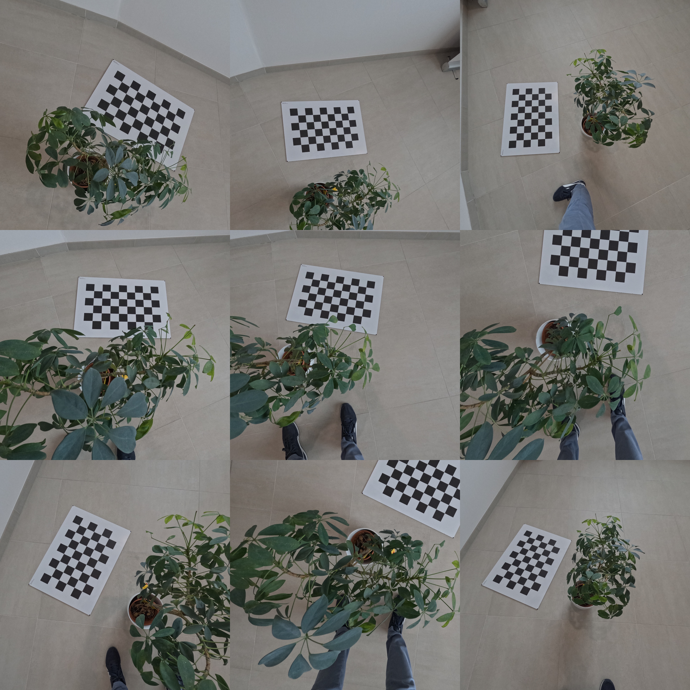
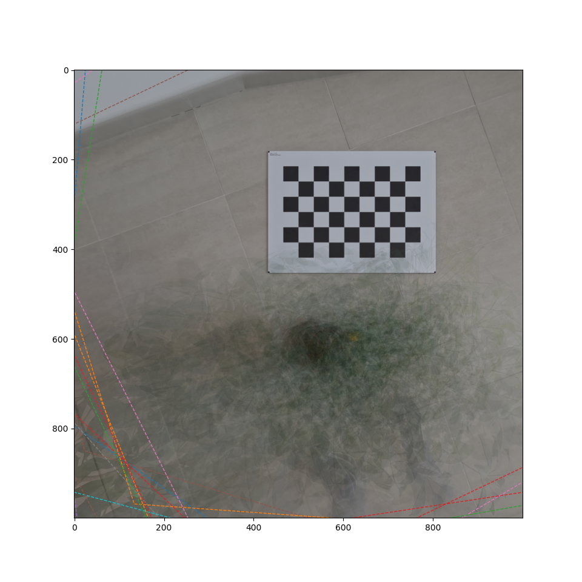
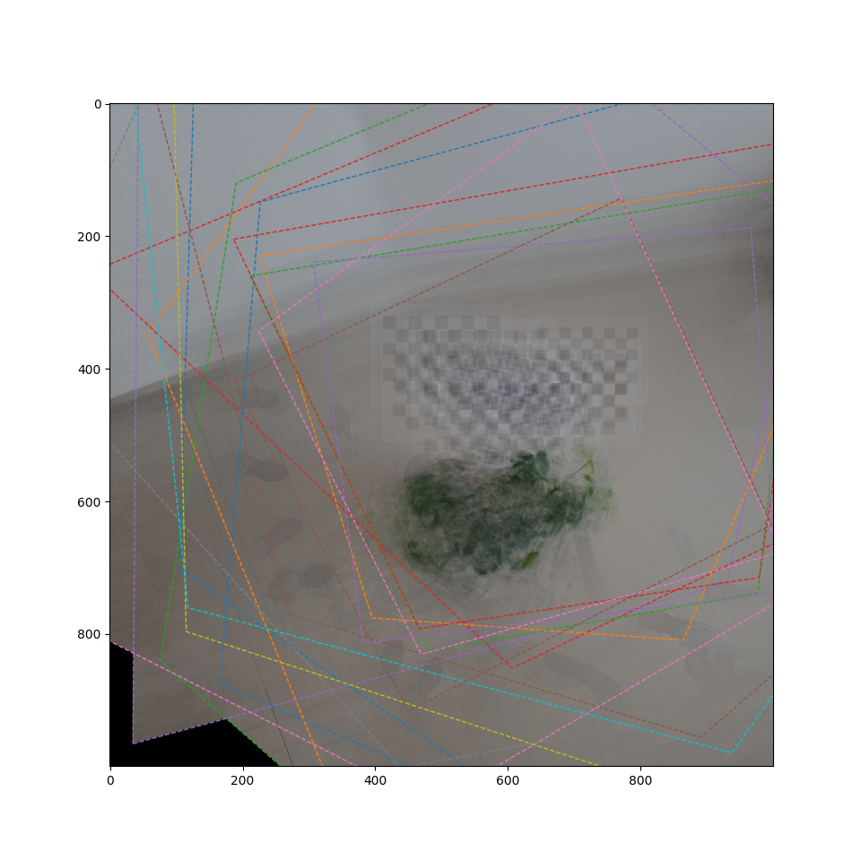
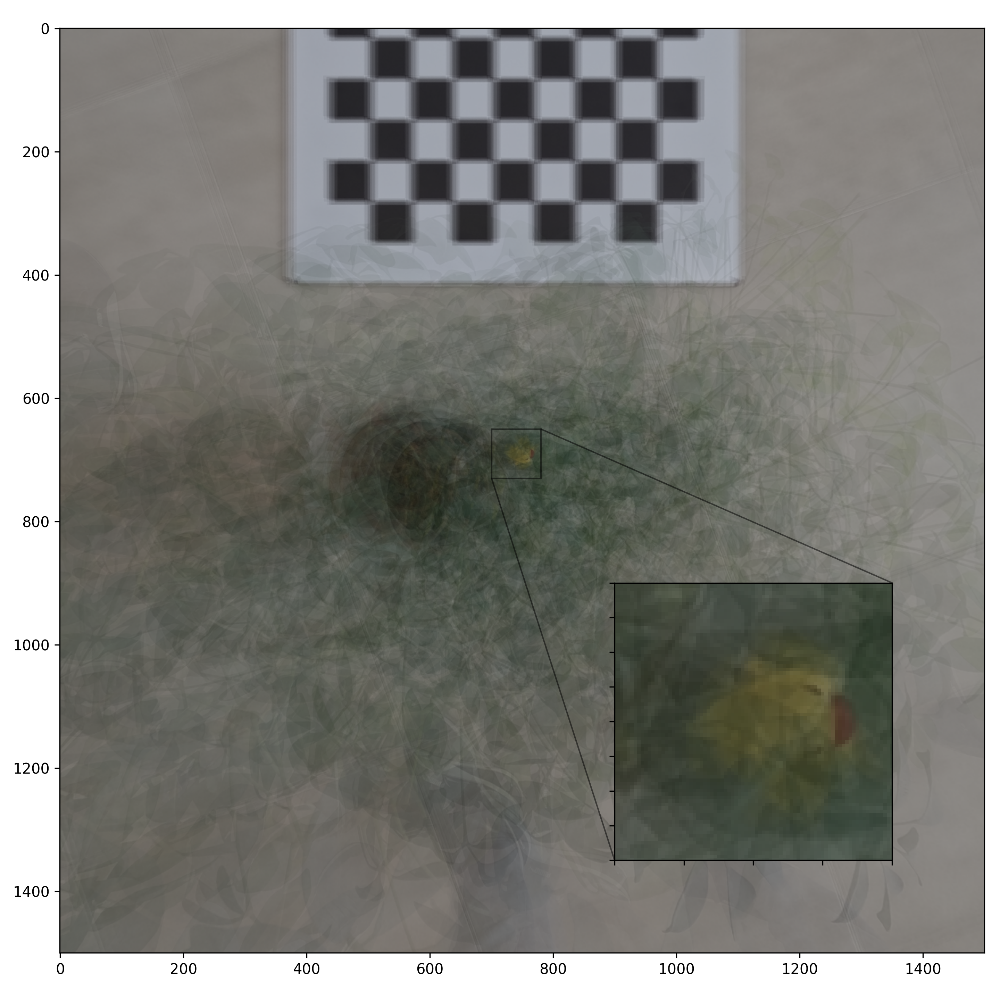
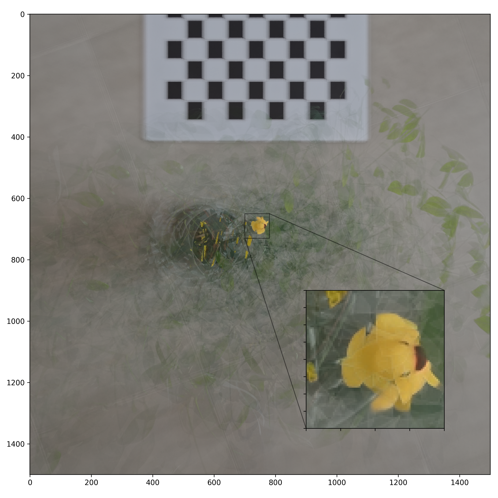

---
title: "Exploiting Out-of-Focus Properties in Image Stitching"
subtitle: "https://github.com/cheind/image-stitch"
author: "Christoph Heindl"
date: "2024-10"
comment: "pandoc -f markdown+tex_math_dollars+yaml_metadata_block+implicit_figures --citeproc OutOfFocusAnalysis.md -o OutOfFocusAnalysis.pdf"
bibliography: biblio.bib
---

# Introduction

In [PlanarImageStitching](./PlanarImageStitching.md), we highlighted the issue of ghosting artifacts that arise during image stitching when the target plane assumption is not met. Objects that do not lie on the assumed target plane can appear misaligned or scattered into inconsistent positions across different viewpoints, leading to visual distortions. 

This effect can be exploited to enhance visibility of in-focus objects that are heavily occluded by out-of-focus ones. This technique has valuable applications in areas such as search-and-rescue operations and ground fire detection, where infrared temperature signatures of people or fires may be partially obscured by trees or foliage, allowing for more effective detection despite these visual obstructions [@kurmi2018airborne].

# Scenario

Here, we present a simplified search-and-rescue scenario. The images below are a subset of 17 captured by a 'drone' flying over a forested area (simulated using plants) that conceals a hidden object (a rubber duck). A calibration pattern is included in the scene to facilitate referencing specific viewpoints.



You can download the dataset from [here](https://drive.google.com/file/d/10h1QwlkxLyLN0XluWZdBL7DUDQ0p9CLN/view?usp=sharing).

# Principle

Out-of-focus makes use of the fact that objects not in the focal plane get dispersed during stitching. We illustrate this by comparing two stitching planes. One 4mm above ground (chessboard) and one parallel to it but lifted by 50cm.

Focus plane 4mm above ground     |  Focus plane 50cm above ground
:-------------------------:|:-------------------------:
  |  

As we increase the distance of the focal plane the ground the chessboard pattern becomes increasingly distorted dispersed across the integrated stiching image. In contrast, portions of the plant become more sharply defined in the second image as the focal plane shifts.

# Objective

Our goal is to enhance the likelihood of successfully locating and rescuing the rubber duck. By applying the out-of-focus principle to reduce the visibility of the surrounding forest structure, we can improve the reconstruction accuracy of in-focus objects. This increases the probability of detecting the rubber duck hidden beneath the foliage.

# Method

Our method is comprised of the following steps:

1. **Define a focal plane** where we expect the rubber duck to be located.
1. **Warp the images** to a virtual camera, with the image plane corresponding to the focal plane chosen in step 1.
1. **Calculate integration weights** that assign a confidence score to each pixel in each view, based on how well it might contain our rubber duck.
1. **Generate the final image** by integrating the pixel values from the warped images, using the computed weights to determine the most reliable information for each pixel position.


Aside from steps 1 and 3, this approach aligns with the default image stitching pipeline. 

## Focal plane

Our rubber duck is approximately 4 cm tall, so we position the focal plane parallel to the ground but shifted upward by about 3 cm to align with the expected height of the duck.

```shell
python stitch.py basepath=data/oof plane.idx=-1 plane.extent="[-0.5,1,0,1.5]" plane.z=0.03 save_raw=true
```

## Weighting strategies
The integration weights determine the relative importance of pixels of each view during integration. By carefully choosing the weights, we increase the probability of spotting the duck. Here we compare three different approaches.

### Baseline

For the baseline weights, we use the default stitching approach, which generally assigns nearly equal weight to each view for each pixel, except at the image borders where the weights gradually decrease.

### Target Color Assumption

Given that rubber ducks are predominantly yellow, a natural strategy is to assign greater importance to pixels that are closer in color to yellow, while reducing the weight of pixels that deviate from this hue. 

We measure the color distance from yellow in the `L*a*b` color space to more closely mimic perceptual color differences, as this color space is designed to align with human visual perception. 

We then compute the weights $w_{ijv}$ for pixel $i,j$ of view $v$ and target color $c$ as

```math
\begin{aligned}
    g_{ijv} &=d(I^{\textrm{LAB}}_{ijv}, c^{\textrm{LAB}})\\
    w_{ijv} &=\frac{\exp(g_{ijv}/T)}{\sum_k\exp(g_{ijk}/T)},    
\end{aligned}
```

where $I^{\textrm{LAB}}_{ijv}$ is the image of view $v$ in LAB color space and $c^{\textrm{LAB}}$ is the target color in LAB space and $T$ is temperature scaling that allows us to gear the sharpness of the resulting normalization.

### Outlier Assumption

If we assume the rubber duck is more often obscured than visible, we can exploit the fact that the duck is underrepresented in the data. 

We compute the weights $w_{ijv}$ for pixel $i,j$ of view $v$ as
```math
\begin{aligned}
    g_{ijv} &=(I^{\textrm{L}}-\bar{I}^{\textrm{L}}_{ij})^2\\
    w_{ijv} &=\frac{\exp(g_{ijv}/T)}{\sum_k\exp(g_{ijk}/T)},    
\end{aligned}
```

where $I^{\textrm{L}}$ is the luminosity image, $\bar{I}^{\textrm{L}}_{ij}$ is the luminosity grayscale value across views, $T$ is temperature scaling that allows us to gear the sharpness of the resulting normalization.

# Evaluation

We conduct a brief evaluation of the different weighting strategies and provide a subjective assessment of the results.

## Baseline

With the baseline weighting strategy, the rubber duck becomes visible, but it appears blurred and mixed with the surrounding leaves, making it easy for an operator to overlook.



```shell
python oof.py rawpath=tmp/stitch-20241013-044050.npz weight_filter=baseline
```

## Color

For yellow rubber ducks, the color-weighting strategy is highly effective, making the rubber duck stand out clearly against its surroundings.



```shell
python oof.py rawpath=tmp/stitch-20241013-044050.npz weight_filter=color color.T=10
```


## Outlier

The outlier weighting scheme performs just as effectively as the color-based strategy, but it has the advantage of requiring less prior information to achieve similar results.


```shell
python oof.py rawpath=tmp/stitch-20241013-044050.npz weight_filter=outlier outlier.T=0.05
```

# Future work

This work is intended as an introductory text on the topic of out-of-focus analysis, also known as "Airborne Optical Sensing". We've briefly covered the basic method and evaluated three different weighting strategies on a challenging rubber duck rescue scenario. Many more advanced weighting methods remain unexplored.

# References
