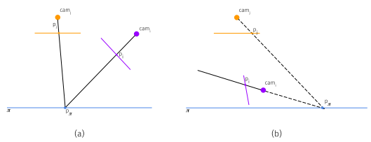
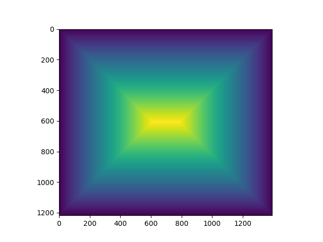

---
title: "Planar Image Stitching from Analytical Homographies"
subtitle: "https://github.com/cheind/image-stitch"
author: "Christoph Heindl"
date: "2024-03"
comment: "pandoc -f markdown+tex_math_dollars+yaml_metadata_block+implicit_figures PlanarImageStitching.md -o PlanarImageStitching.pdf"

---

# Introduction

Image stitching is the process of fusioning multiple overlapping images to produce a composite image. Depending on use case, the resulting image is formed on a planar, cylindrical or spherical canvas. 

The latter two are constrained to cameras sharing a common origin but rotated arbitrarily. The resulting image is usually viewed interactively to avoid severe distortion. The focus of this project is the planar mode, also called scan mode, which requires the target to be sufficiently flat (i.e images captured by a sattelite). In this scenario the cameras can be translated and rotated arbitrarily.

# Assumptions

We assume to be given

1. $N$ images of a planar target residing in plane $\pi$ located $T^w_{\pi}$ wrt.  a world frame $w$,
1. non-linearities are removed from each image $I_n$,
1. and intrinsic camera matrices $K_n$ and view matrices $T^n_w$.

# Outputs

The output of our algorithm is a composite image $I_c$ and associated intrinsic matrix $K_c$. Since all objects, cameras and the target plane, are related through homographies, the image $I_c$ can be formed wrt. to any of the object coordinate systems. Here we look at two special cases

1. Stitching is performed wrt. to a chosen reference camera $r$.
1. Stitching is performed wrt. to virtual camera whose image plane aligns with $\pi$.
 
 The first option stiches the images alongside of $I_r$ in the viewport of camera $r$. The second option fusions the images in a virtual camera whose image plane corresponds to $\pi$. This results in an image having pixel resolution of $R=\frac{px}{m}$ and allows for image based measurements.

# Background

Consider a point 
$$p_\pi=\begin{matrix}[u&v&1]^T\end{matrix}$$ 
in the plane $\pi$. Perspectively we can express $p_\pi$  in terms of camera $i$ as
$$p_i = K_i D T^i_w T^w_\pi U p_\pi ,$$
where equality is defined up to scale. Here
$$
U=
\begin{bmatrix}
    1 & 0 & 0 \\
    0 & 1 & 0 \\
    0 & 0 & 0 \\
    0 & 0 & 1
\end{bmatrix},
$$
lifts $p_\pi$ from UV plane coordinates to homogeneous XYZ world space, $T^i_w \in \mathcal{R}^{4x4}$ is the view transform of camera $i$ wrt. world, likewise $T^w_\pi \in \mathcal{R}^{4x4}$ is the location of the plane in world, $K_i \in \mathcal{R}^{3x3}$ is the intrinsic camera matrix and 
$$ 
D=
\begin{bmatrix}
    1 & 0 & 0 & 0\\
    0 & 1 & 0 & 0\\
    0 & 0 & 1 & 0
\end{bmatrix}
$$
drops the homogeneous fourth coordinate.

When we map the same point $p_\pi$ to camera $i$ and $j$ we get two perspective relations
$$
\begin{aligned}
    p_i &= K_i D T^i_w T^w_\pi U p_\pi \\
    p_j &= K_j D T^j_w T^w_\pi U p_\pi.
\end{aligned}
$$

The term $(K_i D T^i_w T^w_\pi U) = L^i_\pi$ represents an invertible 3x3 matrix. This follows from the fact that a) each individual matrix has rank 3 and b) the rank of a matrix product is related to the rank of the individual matrices and c) that a square matrix is invertible if and only if it has full rank. See [rank properties](https://en.wikipedia.org/wiki/Rank_(linear_algebra)#Properties) for details.

Using the invertability property we rearrange the second equation to
$$
    (L^j_\pi)^{-1}p_j = L^\pi_j p_j = p_\pi,
$$
and substitute for $p_\pi$ in first equation to get
$$
    p_i = L^i_\pi L^\pi_j p_j,
$$
which relates a pixel in camera $j$ to camera $i$. We define
$$
    H_j^i = L^i_\pi L^\pi_j \in \mathcal{R}^{3x3},
$$
to be the homography between camera $j$ and $i$.

In the following figure, the left side (a) illustrates the derivation while (b)
shows the case when $p_i$ gets mapped to point $p_\pi$ which lies behind the camera. This may cause issues when computing the bounds of $I_i$ in $I_j$ from transforming its corners via $H_j^i$. However, warping works usually fine as it is usually implemented using the inverse of $H_j^i$.

# Algorithm

The (simplified) stitching algorithm in this repository works as follows.
 
 1. Choose reference camera intrinsics $K_r$ and view matrix $T^r_w$.
 1. Compute the homography $H_i^r$ for each camera $i$.
 1. Find the extent of the output image $I_c$ by computing the bounding box of image corners transformed by $H_i^r.$
 1. Compute the translation matrix $S$ necessary to avoid negative pixel coordinates and let
    $\hat{H}_i^r=SH_i^r$ be the final homographies.
 1. Warp image $I_i$ using $\hat{H}_i^r$ giving $\hat{I}_i$.
 1. Form the output image $I_c$ from all $\hat{I}_i$ via blending of overlapping pixels.
 1. Return $I_c$ and $K_c=SK_r$.

## Stitching in physical camera viewpoint

In order to stitch in camera $k$ let $T^r_w := T^k_w$ and $K_r:=K_k$ and run the above algorithm.

## Stitching in target plane $\pi$

When stitching in the target plane, we construct a virtual camera whose image plane aligns with plane $\pi$. In particular we need to construct a suitable view matrix $T^r_w$ and intrinsic matrix $K_r$.

Let $T^r_w =  (T_\pi^w T^\pi_r)^{-1}$ with
$$
T^\pi_r=
\begin{bmatrix}
    1 & 0 & 0 &  0 \\
    0 & 1 & 0 &  0 \\
    0 & 0 & 1 & -1 \\
    0 & 0 & 0 & 1
\end{bmatrix},
$$
being the virtual camera frame with respect to plane $\pi$. Here we have chosen the image axes $x,y$ aligned to $u,v$. The camera is offsetted 1 units in negative z, so that the cameras image plane aligns with $\pi$. Note, $z=-1$ and $z=1$ are both possible, but one will give a horizontally flipped image. Which one to choose depends on how the coordinate frame $\pi$ is defined. The flipped image occurs because of a 'see-through' effect.

$K_r$ becomes a pure scaling matrix to account or metric to pixel conversion
$$
K_r=
\begin{bmatrix}
    R & 0 & 0 \\
    0 & R & 0 \\
    0 & 0 & 1
\end{bmatrix},
$$
where $R=\frac{px}{m}$ is a user defined pixel per meter ratio. Note, here we use meters as metric units, but in fact it should be measured in the same units as your extrinsic matrices.

### Blending

This repository implements a simple blending strategy that gives central pixels more weight. 

This strategy is justified for two reasons:

 1. When $T^i_\pi$ is computed from calibration patterns the camera position is typically chosen such that the calibration pattern appears central in the camera image. The pattern is often of finite (small) size, leading to registration errors that amplify towards the image borders.
 1. The observed brightness of real lenses decreases towards the edges of an image decreases due to an effect called lens vignetting.

The dense pixel weights $W_i$ are computed by a simple distance transform that computes the distance for each pixel to the nearest border as shown below (yello is large weight)

We then warp the $W_i$ alongside with $I_i$ and then compute $I_c$ as the weighted average.

# Limitations

## Boundary detection
To detect the boundaries of the composite image $I_c$ the bounding box of the transformed image corners of each source view is computed. When source and reference planes associated with the homography $H^r_i$ are angled in a specific ways, corners may be reflected in $r$. This causes the the transformed view boundaries to become non-convex and bounding box detection might fail.

## Shared intrinsics
The current code assumes a single moving camera with shared intrinsics.

## Ghosting
Moving and out-of plane objects cause ghosting artefacts due to the blending approach taken.

