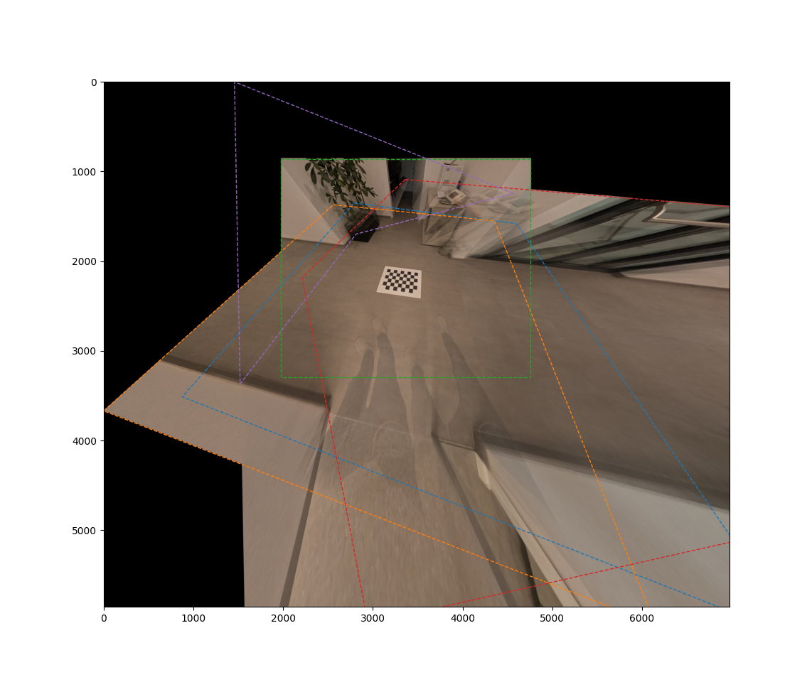
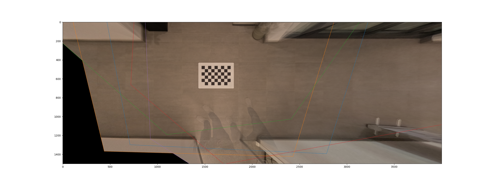
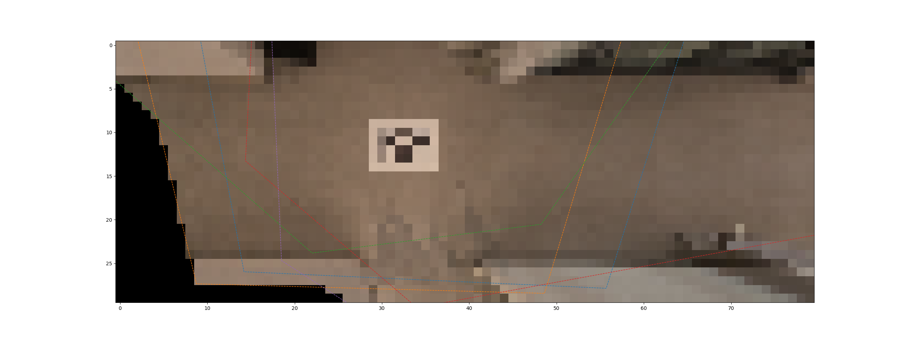

# Planar Image Stitching

This repository demonstrates stitching multiple images of a **planar target**. We analytically derive homographies by assuming the camera poses with respect to the target are known. Hence neihter feature matching nor  Linear Transforms (DLTs) are required to estimate the homographies. The following image shows four views stitched in the green reference camera frame. 

<p align="center" width="100%">

</p>

In the following image the same scene is stitched in a virtual camera whose image plane aligns with the ground plane, having a pixel resolution of 500px per meter, which is suited well for taking direct metric measurements.

<p align="center" width="100%">

</p>

Both images exhibit ghosting artefacts causved by blending moving objects and warping objects that violate the in-target-plane assumption. 

## Theory

See [PlanarImageStitching.pdf](PlanarImageStitching.pdf) for background information on the stitching process.

## Applications

The ghosting effect has intriguing applications in search-and-rescue scenarios. In particular, [OutOfFocusAnalysis.md](OutOfFocusAnalysis.md) explores techniques for reconstructing objects that are significantly obscured by out-of-focus elements, providing valuable insights for improving visibility in challenging environments. This allows us to go from 

<div align="center">

</p>

to

<div align="center">

</p>


## Usage

The code provided is for demonstration purposes only. It is limited to a scenario in which a moving camera observes a ground floor. The extrinsics are computed from knowing the fisheye intrinsics/distortions and the calibration pattern configuration.

### Stitching

```shell
# Stitch in camera 3 view (index starting at zero)
python stitch.py basepath=data/ plane.idx=2
```
<p align="center" width="100%">

</p>


```shell
# Stitch in plane pi using px/m of 500
python stitch.py basepath=data/ plane.idx=-1 plane.px_per_m=500 plane.extent="[-3, 5, -1, 2]"
```
<p align="center" width="100%">

</p>

```shell
# Stitch in plane pi using px/m of 10
python stitch.py basepath=data/ plane.idx=-1 plane.px_per_m=10 plane.extent="[-3, 5, -1, 2]"
```
<p align="center" width="100%">

</p>

### Out-of-Focus (Ducky Rescue)

Frist, stitch in a plane parallel to ground but lifted by 0.03m. We turn on saving of raw values which provides us the necessary information for performing
out-of-focus analysis.

```shell
# Stitch and save intermediate results
python stitch.py basepath=data/oof plane.idx=-1 plane.extent="[-0.5,1,0,1.5]" plane.z=0.03 save_raw=true
``` 

```shell
# Perform out-of-focus analysis
python oof.py rawpath=tmp/stitch-20241013-044050.npz color.T=10 integrate.min_weight=0.2
python oof.py rawpath=tmp/stitch-20241013-044050.npz weight_filter=baseline
python oof.py rawpath=tmp/stitch-20241013-044050.npz weight_filter=color   
python oof.py rawpath=tmp/stitch-20241013-044050.npz weight_filter=outlier
```
