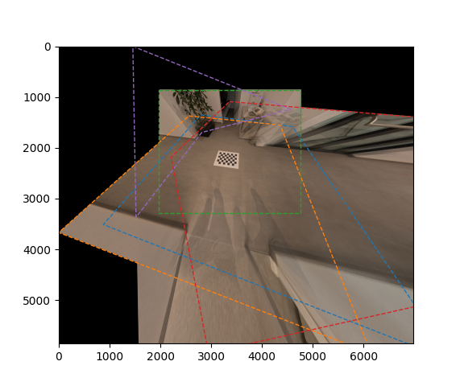

# Planar Image Stitching

The code in this repository demonstrates stitching of images captured by cameras observing a **planar target**. We analytically derive homographies by assuming the camera pose wrt. to the target are known. The following image shows four views stitched in the green reference camera frame. 

<p align="center" width="100%">

</p>

In the following image the same scene is stitched in a virtual camera whose image plane aligns with the ground plane, having a pixel resolution of 500px per meter, which is suited well for taking direct metric measurements.

<p align="center" width="100%">

</p>

Both images exhibit ghosting artefacts caused by blending moving objects and warping objects that violate the in-target-plane assumption. 

## Theory

See [PlanarImageStitching.pdf](PlanarImageStitching.pdf) for background information on the stitching process.

## Usage

The code provided is for demonstration purposes only. It is limited to a scenario in which a moving fisheye camera observes a ground floor. The extrinsics are computed from knowing the fisheye intrinsics/distortions and the pattern configuration.

```shell
# Stitch in camera 3 view (index starting at zero)
python stitch.py -r 2
```

<p align="center" width="100%">

</p>


```shell
# Stitch in plane pi using px/m of 500
python stitch.py -r -1 -px-per-m 500
```


```shell
# Stitch in plane pi using px/m of 10
python stitch.py -r -1 -px-per-m 10
```

